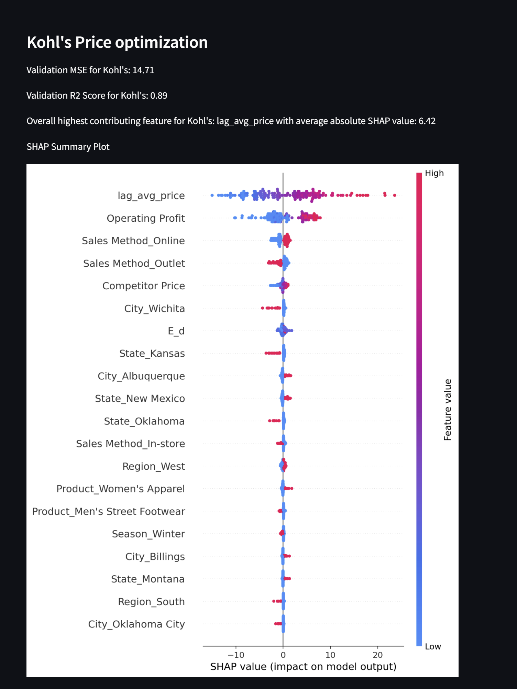

# Retail Price Optimization for Adidas Products

## Overview
The project aims to predict the price of various Adidas products sold by multiple retailers on the particular day. By considering factors such as price sensitivity, competition, and historical pricing data, the project leverages machine learning techniques to predict the best price per unit for each product across retailers.

##Features

### 1. Dataset Description
The [Adidas Sales dataset ](https://www.kaggle.com/datasets/afzashaikh/adidas-sales-dataset/data) used in this project is a sales record of Adidas products across six retailers. It includes information such as product prices, units sold, total sales, and other details. The dataset is stored in `data.csv`. dditionally, separate CSV files are created for each retailer after feature engineering steps.

### 2. Exploratory Data Analysis (EDA)
The file `eda.ipynb` involves the exploratory data analysis and preprocessing steps:
- Visualizing trends and patterns in the dataset.
- Calculating and analyzing price elasticity, lagged price, and competitor pricing.
- Creates seperate csv file for each retailer.

### 3. Feature Engineering
New features are engineered to enhance the model:
- **Competitor Pricing**: The competitor price is calculated as the average price of other retailers for a product on a given date.
- **Lagged Price**: The average price of the product over the last week.
- **Price Elasticity**: Measures how sensitive demand is to price changes.
These features are added to the dataset to capture demand sensitivity and competitive pricing dynamics.

### 3. Price per Unit Optimization
A Random Forest regression model is used to predict the price per unit for each product across retailers .

### 4. Model Interpretation with SHAP
The **SHAP (SHapley Additive exPlanations)** algorithm is applied to interpret the predictions of the Random Forest model. SHAP plots are visualized for each step, showing how different features influence the model's predictions.

### 5. Interactive Visualization
The file `prediction.py` contains the Streamlit app that presents the model's predictions and SHAP visualizations interactively. Users can explore and understand the pricing optimization results through an easy-to-use interface.

## Output

Here is a visualization of the model's output:

